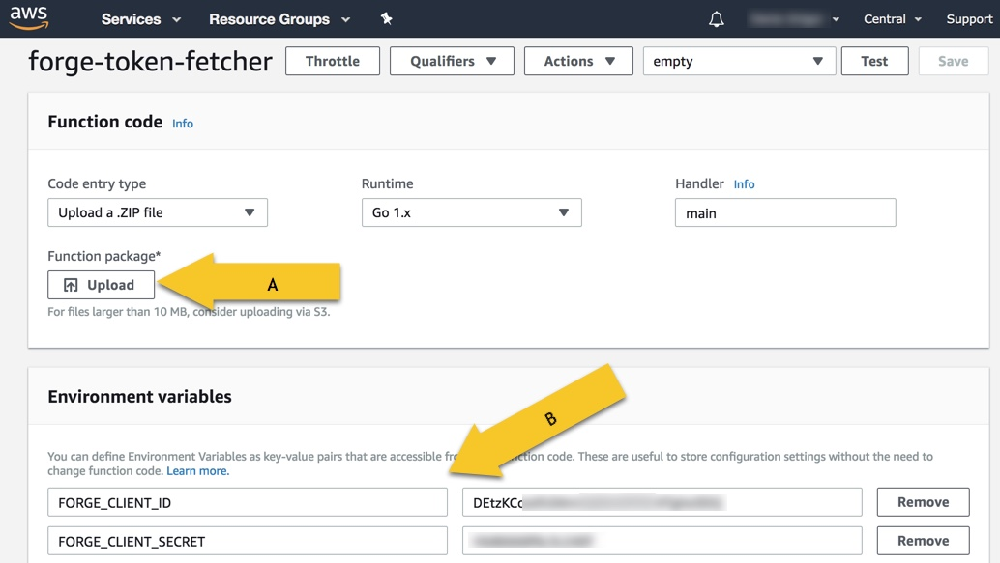
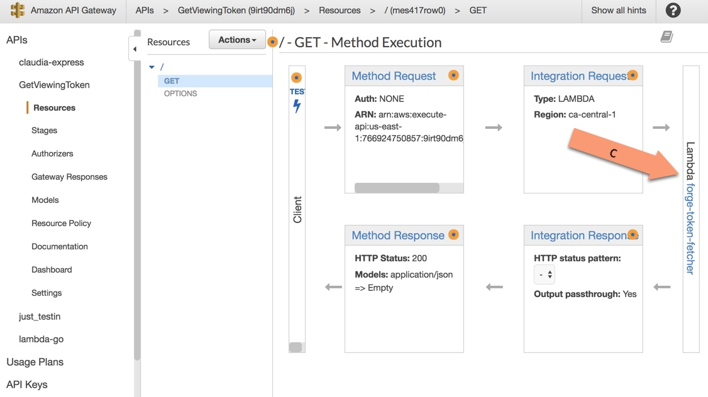

## AWS Lambda token fetcher

Small lambda written in Golang and used to get `viewables:read` 2-legged tokens, which in conjunction with AWS API Gateway creates the minimal backend needed for serving to Forge Viewer the access tokens.

### Setup
1. create a deployment package following the [AWS guide](https://docs.aws.amazon.com/lambda/latest/dg/lambda-go-how-to-create-deployment-package.html) or create a new lambda through AWS portal and upload the zip file (either prepared by you or downloaded from [releases](https://github.com/apprentice3d/aws-lambda-token-fetcher/releases))(A).
2.  Set the environment variables with your Autodesk Forge credentials (as shown in bellow at B). 

    <br/>   
3. Through AWS portal, in API Gateway, create a new API, set the integration type as lambda and specify the AWS lambda created at step 1.

 </br>
4. Use the endpoint created by the API Gateway, in your apps to get the `viewables:read` tokens, used by viewer to display your models:

```javascript
    let options = {
        env: 'AutodeskProduction',
        getAccessToken: (onGetAccessToken) => {
            fetch('https://9irt90dm6j.execute-api.us-east-1.amazonaws.com/prod')
                .then(response => response.json())
                .then(data => {
                    let accessToken = data["access_token"];
                    let expireTimeSeconds = data["expires_in"];
                    onGetAccessToken(accessToken, expireTimeSeconds);
                })
        }
    };
```
